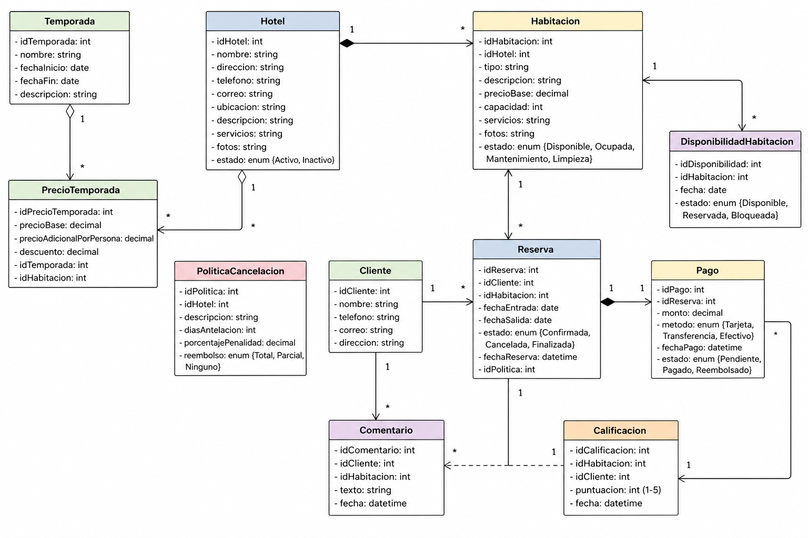

# Sistema de Agencia de Viajes

 


- ver [badgen](https://badgen.net/) o [shields](https://shields.io/) para otros tipos de _badges_

## Autor

Brayan Esmith Gil Alvarez

## Descripción del Proyecto

El proyecto consiste en el desarrollo de un sistema de reservas de hoteles orientado a mejorar la gestión y experiencia tanto para los administradores como para los clientes. A partir del análisis de la entrevista, se identificó la necesidad de centralizar la información de los hoteles, incluyendo datos básicos como nombre, ubicación y contacto, así como detalles más específicos como servicios ofrecidos, ofertas especiales, estados de actividad y características de las habitaciones. Además, el sistema debe permitir la administración de políticas de pago y cancelación, junto con la gestión de disponibilidad mediante calendarios que indiquen las fechas ocupadas o libres de cada habitación.

Por otro lado, el sistema estará enfocado en brindar una experiencia intuitiva al cliente, permitiéndole registrarse, buscar habitaciones utilizando distintos criterios como ubicación, precio, fechas y calificación, y acceder a información detallada antes de realizar una reserva. También se incluirá un sistema de calificaciones y comentarios que permitirá evaluar tanto las habitaciones como los hoteles en general, facilitando la toma de decisiones. Finalmente, el proceso de reserva se completará con la confirmación del pago, garantizando así una gestión eficiente, organizada y confiable del servicio.

## Documentación

Revisar la documentación en [`./docs`](./docs)

### Requerimientos

- R1: El sistema debe permitir el registro de hoteles con información básica como nombre, dirección, teléfono, correo electrónico y ubicación geográfica.
- R2: El sistema debe permitir agregar descripciones, servicios, fotos y ofertas especiales a cada hotel.
- R3: El sistema debe permitir gestionar habitaciones asociadas a cada hotel, incluyendo tipo, descripción, precio, capacidad, servicios y fotos.
- R4: El sistema debe permitir establecer y modificar el estado de un hotel (activo/inactivo).
- R5: El sistema debe permitir establecer y modificar el estado de una habitación (disponible, ocupada, en mantenimiento, limpieza, etc.).
- R6: El sistema debe manejar calendarios de disponibilidad por habitación, indicando fechas reservadas y disponibles.
- R7: El sistema debe permitir definir precios de habitaciones según factores como cantidad de personas y temporada.
- R8: El sistema debe permitir gestionar temporadas (alta/baja) y su influencia en precios y promociones.
- R9: El sistema debe permitir configurar políticas de pago (pago anticipado o al llegar).
- R10: El sistema debe permitir configurar políticas de cancelación y reembolsos.
- R11: El sistema debe permitir registrar clientes con datos como nombre, teléfono, correo electrónico y dirección.
- R12: El sistema debe permitir a los clientes buscar habitaciones por criterios como fecha, ubicación, precio y calificación.
- R13: El sistema debe permitir visualizar información detallada de cada habitación antes de reservar.
- R14: El sistema debe permitir realizar reservas seleccionando fechas y habitación.
- R15: El sistema debe permitir confirmar reservas mediante el registro de pago.
- R16: El sistema debe permitir cancelar reservas según las políticas establecidas.
- R17: El sistema debe gestionar reembolsos de acuerdo con las políticas de cancelación.
- R18: El sistema debe permitir a los clientes calificar y comentar su experiencia después de la estancia.
- R19: El sistema debe calcular y mostrar la calificación promedio por habitación.
- R20: El sistema debe calcular y mostrar la calificación general del hotel.
- R21: El sistema debe ser intuitivo y fácil de usar para los clientes.
- R22: El sistema debe garantizar la disponibilidad y consistencia de la información en tiempo real (especialmente calendarios de reservas).
- R23: El sistema debe ser seguro, protegiendo la información personal de los clientes.
- R24: El sistema debe ser escalable para soportar múltiples hoteles y usuarios simultáneamente.
- R25: El sistema debe tener un buen rendimiento en las búsquedas y reservas.
- R26: El sistema debe permitir la actualización constante de información sin afectar su funcionamiento.
- R27: El sistema debe ser confiable, evitando errores en reservas o pagos.

### Diseño



### Tárifas

|destino|pasajes|silver|gold|platinum|
|:---|---:|---:|---:|---:|
|Aruba|418|134|167|191|
|Bahamas|423|112|183|202|
|Cancún|350|105|142|187|
|Hawaii|858|210|247|291|
|Jamaica|380|115|134|161|
|Madrid|496|190|230|270|
|Miami|334|122|151|183|
|Moscu|634|131|153|167|
|NewYork|495|104|112|210|
|Panamá|315|119|138|175|
|Paris|512|210|260|290|
|Rome|478|184|220|250|
|Seul|967|205|245|265|
|Sidney|1045|170|199|230|
|Taipei|912|220|245|298|
|Tokio|989|189|231|255|

## Instalación

A continuación se describen los pasos necesarios para instalar el sistema de reservas de hoteles en un entorno local.

1. Clonar el proyecto

    ```bash
    git clone https://github.com/clubdecomputacion/lpa1-taller-requerimientos.git
    ```

2. Crear y activar entorno virtual

    ```bash
    cd lpa1-taller-requerimientos
    python3 -m venv venv
    source venv/bin/activate
    ```

3. Instalar librerías y dependencias

    ```bash
    pip install -r requirements.txt
    ```
    
## Ejecución

Una vez instaladas las dependencias, se puede ejecutar el sistema de la siguiente manera:

1. Ejecutar el proyecto

    ```bash
    cd lpa1-taller-requerimientos
    python3 app.py
    ```

